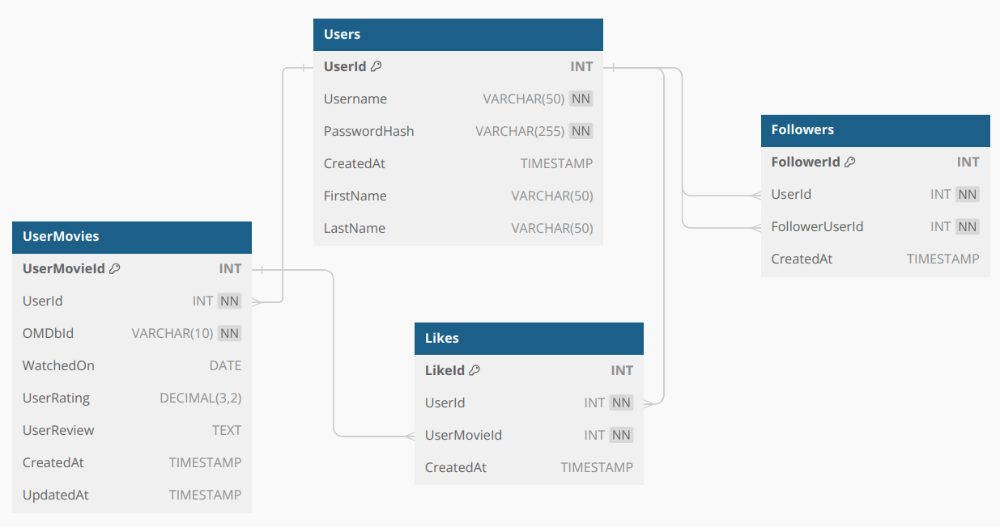

# Project2_OMDb_API_Movies_Content_Management_System_Group1

## Project Overview
### Title: The Movies Content Management System
### Layers: Client-Server
### Architectural Style: RESTful
### Platform: .NET
### Framework: ASP.NET Core (Web API)
### Keywords: REST, API, OMDb API, content management system, search, social media

####
The OMDb API is a RESTful web service that provides movie information. The Movies Content Management System is a CMS designed to interface with the OMDb API and allows users to manage a list of movies they have seen, with social media capabilities to share this list with followers, and to like or dislike movies on other users' lists. The system will maintain a ranking of the most added movies to user lists. This helps users discover popular movies widely appreciated by the community.

#### Client
The frontend uses the React library. And front-end testing is done with Jest. The user will be able to login. And once authenticated, an authorized user can add, view, edit, and delete a movie in the user's movie list.

To add a movie to a user's movie list, the user can search for a movie, the OMDb API will be used to provide metadata for the movie. The user can then proceed to add the movie to the user’s list with additional metadata for which the user will provide responses. Examples of the additional metadata include when the user saw the movie and any memorable experience the user had with the movie. The movie is then persisted to the user's list on the remote SQL Db server. Any metadata needed to retrieve the movie from the OMDb API will also be persisted. After a user adds a movie to the list, the user can then manage the movies on the list by performing the following CRUD: view, edit, and delete from the list of movies.

Viewing a movie on the user's list will display an image of the movie along with both OMDb API's metadata and OMDb Movies CMS metadata the user has supplied. Editing the movie will involve editing the responses to OMDb Movies CMS metadata during when the movie was added to the list.

#### Server
The backend uses ASP.NET and talks to an SQL Db server to persist the user's notes about the movie and the minimum required metadata for future retrieval of the movie on the user's list. All user interactions with the server will be done through the frontend web user interface. Users will authenticate using a simple username and password scheme, stored securely in the SQL database.

The backend technologies encompass:

    C# (Backend programming language)s
    EF Core (ORM)
    SQL Server (Azure hosted)
    ASP.NET Core (Web API Framework)
    xUnit/Moq (Backend Testing)
    Azure App Service (for application hosting)

#### MVP Features (Requirements)
    Application must build and run.
    xUnit Testing (70% branch coverage for Services + Utilities and Models layer) for backend.
    Utilize an external API.
    Allows for multiple users to authenticate and store their data.
    HTML/CSS/JS or React front-end.
    Front end unit testing (20% coverage.)
    Hosted on Github in our training Org in it's own repository.

#### ERD

#### External API
OMDB API url link: https://www.omdbapi.com/

#### Stretch Goals
    JWT or IDaaS for authentication (such as ASP.NET Core Identity, or Auth0.)
    Backend hosted on Azure Cloud Services.
    React front end.
    React testing.
